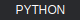
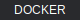

# ▓▒░ 𝐌·𝐃·𝐅·𝐗 ░▒▓

<p align="center">
    
</p>

**Design for markdown.** Transform templates into styled output with Unicode typography, SVG components, and decorative frames.

---

## 【At a Glance】

<p align="center">
   
</p>

Write this:
```markdown
{{mathbold}}CHAPTER ONE{{/mathbold}}
{{ui:progress:75/}}
{{frame:star}}FEATURED{{/frame}}
```

Get this:

> 𝐂𝐇𝐀𝐏𝐓𝐄𝐑 𝐎𝐍𝐄
>
> 
>
> ★ FEATURED ☆

---

## 𝐈𝐧𝐬𝐭𝐚𝐥𝐥

```bash
cargo install mdfx-cli
```

---

## ◆ Typography ◇

23 Unicode text styles. No fonts required.

| | |
|---|---|
| 𝐌𝐀𝐓𝐇𝐁𝐎𝐋𝐃 | 𝔉ℜ𝔄𝔎𝔗𝔘ℜ |
| 𝒮𝒞ℛℐ𝒫𝒯 | 𝔻𝕆𝕌𝔹𝕃𝔼𝕊𝕋ℝ𝕌ℂ𝕂 |
| ⓒⓘⓡⓒⓛⓔⓓ | 𝙼𝙾𝙽𝙾𝚂𝙿𝙰𝙲𝙴 |
| ꜱᴍᴀʟʟᴄᴀᴘꜱ | 🅽🅴🅶 |

**Separators and spacing:**

𝐃·𝐎·𝐓·𝐓·𝐄·𝐃 · 𝒜→ℛ→ℛ→𝒪→𝒲→𝒮 · ꜱ   ᴘ   ᴀ   ᴄ   ᴇ   ᴅ

---

## ◆ Frames ◇

29 decorative borders. Pure Unicode.

| | |
|---|---|
| ▓▒░ GRADIENT ░▒▓ | 【LENTICULAR】 |
| ★ STARRED ☆ | « QUOTED » |
| ▶ TRIANGLES ◀ | ═══ DOUBLE ═══ |
| ☞ POINTED ☜ | 《ANGLED》 |

---

## ◆ Components ◇

### Progress


### Sliders


### Circular

<p align="center">
   
</p>

### Gauges

<p align="center">
  
</p>

### Sparklines

| Type | Chart |
|------|-------|
| Line |  |
| Bar |  |
| Area |  |

### Swatches

<p align="center">
       
</p>

### Tech

<p align="center">
     
</p>

---

## 𝐔𝐬𝐚𝐠𝐞

```bash
# Process a template
mdfx process README.template.md -o README.md

# SVG backend for local docs
mdfx process input.md -o output.md --backend svg --assets-dir assets/

# Multi-target build
mdfx build input.md --all-targets
```

**Targets:**
- `github` / `gitlab` → shields.io badges
- `local` → SVG files
- `pypi` → Unicode plaintext

---

## 𝐏𝐚𝐥𝐞𝐭𝐭𝐞

| Token | Hex | |
|-------|-----|---|
| accent | F41C80 |  |
| success | 22C55E |  |
| warning | EAB308 |  |
| error | EF4444 |  |
| info | 3B82F6 |  |
| cobalt | 2B6CB0 |  |
| plum | 6B46C1 |  |

Custom: `mdfx process --palette brand.json input.md`

---

## 𝐃𝐨𝐜𝐮𝐦𝐞𝐧𝐭𝐚𝐭𝐢𝐨𝐧

| | |
|---|---|
| [Components](docs/guides/COMPONENTS-GUIDE.md) | UI primitives |
| [Progress](docs/guides/PROGRESS-GUIDE.md) | Progress bars |
| [Donut & Gauge](docs/guides/DONUT-GAUGE-GUIDE.md) | Circular charts |
| [Sparklines](docs/guides/SPARKLINE-GUIDE.md) | Inline charts |
| [Text Styles](docs/guides/TEXT-STYLES-GUIDE.md) | 23 styles |
| [Frames](docs/guides/FRAMES-GUIDE.md) | 29 borders |
| [Glyphs](docs/guides/GLYPHS-GUIDE.md) | 500+ symbols |
| [CLI](docs/guides/CLI-GUIDE.md) | Commands |

---

▒░ ᴍɪᴛ ʟɪᴄᴇɴꜱᴇ ░▒ · [GitHub](https://github.com/blackwell-systems/mdfx) · [Changelog](CHANGELOG.md)
