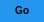
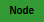

# 【𝐌𝐃𝐅𝐗】

<p align="center">
   
</p>

**Design for markdown.** Transform templates into styled output with Unicode typography, SVG components, and decorative frames.

**Zero dependencies at runtime.** Generate SVG assets that render on GitHub without shields.io. Your READMEs work offline, forever.

---

## 【At a Glance】

<p align="center">
&nbsp;&nbsp;&nbsp;&nbsp;&nbsp;&nbsp;&nbsp;&nbsp;&nbsp;&nbsp;&nbsp;&nbsp;
</p>

Write this:
```markdown
{{mathbold}}CHAPTER ONE{{/mathbold}}
{{ui:progress:75/}}
{{frame:star}}FEATURED{{/frame}}
```

Get this:

> 𝐂𝐇𝐀𝐏𝐓𝐄𝐑 𝐎𝐍𝐄
>
> 
>
> ★ FEATURED ☆

---

## 𝐈𝐧𝐬𝐭𝐚𝐥𝐥

```bash
cargo install mdfx-cli
```

---

## ◆ Typography ◇

24 Unicode text styles. No fonts required.

| | |
|---|---|
| 𝐌𝐀𝐓𝐇𝐁𝐎𝐋𝐃 | 𝔉ℜ𝔄𝔎𝔗𝔘ℜ |
| 𝒮𝒞ℛℐ𝒫𝒯 | 𝔻𝕆𝕌𝔹𝕃𝔼𝕊𝕋ℝ𝕌ℂ𝕂 |
| ⓒⓘⓡⓒⓛⓔⓓ | 𝙼𝙾𝙽𝙾𝚂𝙿𝙰𝙲𝙴 |
| ꜱᴍᴀʟʟᴄᴀᴘꜱ | 🅽🅴🅶 |

**Separators and spacing:**

𝐃·𝐎·𝐓·𝐓·𝐄·𝐃 · 𝒜→ℛ→ℛ→𝒪→𝒲→𝒮 · ꜱ   ᴘ   ᴀ   ᴄ   ᴇ   ᴅ

---

## ◆ Frames ◇

29 preconfigured frames with full 531 glyph support. Any symbol becomes a frame.

| Preconfigured | |
|---|---|
| ▓▒░ GRADIENT ░▒▓ | 【LENTICULAR】 |
| ★ STARRED ☆ | « QUOTED » |
| ═══ DOUBLE ═══ | ───  LIGHT  ─── |

| Glyph Frames | |
|---|---|
| ♦ DIAMOND ♦ | ⚡ LIGHTNING ⚡ |
| ☢ RADIOACTIVE ☢ | ♠ SPADES ♠ |

**Syntax:**
```markdown
{{fr:gradient}}TEXT{{//}}             <!-- short form + universal close -->
{{fr:glyph:misc.lightning}}ZAP{{//}}  <!-- any of 531 named glyphs -->
```

`{{//}}` closes any open frame, style, or nested tag.

---

## ◆ Glyphs ◇

531 named Unicode symbols. Access obscure characters by memorable names.

| Category | Examples |
|----------|----------|
| Shapes | ● ○ ◆ ◇ ▲ △ ■ □ |
| Arrows | → ← ↑ ↓ ⇒ ⇐ ⇔ ↔ |
| Checks | ✓ ✔ ✗ ✘ ☐ ☑ ☒ |
| Math | ∞ ≠ ≈ √ ∑ ∫ ± × |
| Blocks | █ ▓ ▒ ░ ▄ ▀ ▌ ▐ |
| Music | ♩ ♪ ♫ ♬ ♭ ♯ |
| Cards | ♠ ♥ ♦ ♣ ♤ ♡ ♢ ♧ |
| Badges | ① ② ③ ❶ ❷ ❸ Ⓐ Ⓑ |

```markdown
{{glyph:check.yes}} Done               <!-- ☑ Done -->
{{glyph:arrow.right}} Next             <!-- → Next -->
{{mathbold:separator=diamond}}TEXT{{//}}  <!-- 𝐓◆𝐄◆𝐗◆𝐓 -->
```

---

## ◆ Components ◇

### Progress


### Sliders


### Circular

<p align="center">
   
</p>

### Gauges

<p align="center">
  
</p>

### Sparklines

| Type | Chart |
|------|-------|
| Line |  |
| Bar |  |
| Area |  |

### Swatches

<p align="center">
       
</p>

### Tech

<p align="center">
     
</p>

---

## 𝐔𝐬𝐚𝐠𝐞

```bash
# Generate offline SVG assets (recommended)
mdfx process README.template.md -o README.md --backend svg --assets-dir assets/

# Process with shields.io fallback
mdfx process README.template.md -o README.md

# Multi-target build
mdfx build input.md --all-targets
```

**Backends:**
- `svg` → Local SVG files, commit to repo, no external dependencies
- `shields` → shields.io badges (requires network)
- `plaintext` → Unicode text only

---

## 𝐃𝐨𝐜𝐮𝐦𝐞𝐧𝐭𝐚𝐭𝐢𝐨𝐧

| | |
|---|---|
| [Components](docs/guides/COMPONENTS-GUIDE.md) | UI primitives |
| [Colors](docs/guides/COLORS-GUIDE.md) | Palette system |
| [Progress](docs/guides/PROGRESS-GUIDE.md) | Progress bars |
| [Donut & Gauge](docs/guides/DONUT-GAUGE-GUIDE.md) | Circular charts |
| [Sparklines](docs/guides/SPARKLINE-GUIDE.md) | Inline charts |
| [Text Styles](docs/guides/TEXT-STYLES-GUIDE.md) | 24 styles |
| [Frames](docs/guides/FRAMES-GUIDE.md) | 29 borders |
| [Glyphs](docs/guides/GLYPHS-GUIDE.md) | 531 symbols |
| [CLI](docs/guides/CLI-GUIDE.md) | Commands |

---

▒░ ᴍɪᴛ ʟɪᴄᴇɴꜱᴇ ░▒ · [GitHub](https://github.com/blackwell-systems/mdfx) · [Changelog](CHANGELOG.md)
