# mdfx Architecture

**Version:** 1.0.0
**Last Updated:** 2025-12-13

## Table of Contents

- [Workspace Structure](#workspace-structure) 🆕
- [System Overview](#system-overview)
- [Three-Layer Architecture](#three-layer-architecture)
- [Component Responsibilities](#component-responsibilities)
- [Expansion Model](#expansion-model)
- [Parser Design](#parser-design)
- [Multi-Backend Rendering](#multi-backend-rendering) 🆕
- [Data Packaging](#data-packaging)
- [Performance Characteristics](#performance-characteristics)
- [Key Design Decisions](#key-design-decisions)
- [Extension Points](#extension-points)

---

## Workspace Structure

mdfx uses a Cargo workspace to separate library and CLI concerns:

```
mdfx/
├── Cargo.toml                    # Workspace root
│   └── [workspace.package]       # Shared metadata
├── crates/
│   ├── mdfx/                     # Core library
│   │   ├── Cargo.toml           # Package: mdfx
│   │   ├── data/                # JSON data files
│   │   │   ├── styles.json
│   │   │   ├── components.json
│   │   │   ├── palette.json
│   │   │   ├── shields.json
│   │   │   ├── frames.json
│   │   │   └── badges.json
│   │   └── src/
│   │       ├── lib.rs
│   │       ├── converter.rs
│   │       ├── parser.rs
│   │       ├── components.rs
│   │       ├── primitive.rs
│   │       ├── renderer/
│   │       │   ├── mod.rs
│   │       │   ├── shields.rs
│   │       │   └── svg.rs
│   │       └── ...
│   └── mdfx-cli/                # CLI application
│       ├── Cargo.toml           # Package: mdfx-cli
│       └── src/
│           └── main.rs          # Binary: mdfx
```

### Design Rationale

**Library Crate (`mdfx`):**
- Minimal dependencies (4 total)
- No CLI-specific deps (clap, colored excluded)
- Can be embedded in other Rust applications
- Smaller compile times for library users

**CLI Crate (`mdfx-cli`):**
- Thin wrapper around library
- Handles argument parsing (clap)
- Terminal formatting (colored)
- Binary named `mdfx` for UX

### Dependency Analysis

**Library (`mdfx`):**
```toml
serde = "1.0"          # JSON deserialization
serde_json = "1.0"     # Data file loading
thiserror = "1.0"      # Error handling
lazy_static = "1.4"    # Static data loading
```

**CLI (`mdfx-cli`):**
```toml
mdfx = { path = "../mdfx" }     # Core library
clap = "4.4"                     # Argument parsing
clap_complete = "4.4"            # Shell completions
colored = "2.1"                  # Terminal colors
```

---

## System Overview

mdfx is a markdown preprocessor that transforms text using Unicode character mappings, decorative frames, and multi-backend rendering. The library consists of **five primary components** working together in a **three-layer pipeline architecture**.

### Three Layers

1. **UI Components** (`{{ui:*}}`) - High-level semantic elements users write
2. **Primitives** (`{{shields:*}}`, `{{frame:*}}`, `{{badge:*}}`) - Rendering engines
3. **Styles** (`{{mathbold}}`) - Character transformations

**Key Innovation:** Components **expand** to primitives at parse time, keeping user-facing syntax concise while maintaining full customization power.

### System Diagram

```mermaid
%%{init: {'theme':'dark'}}%%
graph TB
    subgraph CLI["mdfx-cli (Binary)"]
        CMD[CLI Args] --> MAIN[main.rs]
    end

    subgraph LIB["mdfx (Library)"]
        MAIN --> PARSER[TemplateParser]
        PARSER --> UI[ComponentsRenderer]

        UI -->|ComponentOutput| DECISION{Output Type?}

        DECISION -->|Primitive| BACKEND[Backend<br/>Box&lt;dyn Renderer&gt;]
        DECISION -->|Template| RECURSE[Recursive Parse]

        BACKEND -->|Trait Dispatch| SHIELDS[ShieldsBackend]
        BACKEND -->|Trait Dispatch| SVG[SvgBackend]

        SHIELDS --> INLINE[InlineMarkdown]
        SVG --> FILES[File Assets]

        RECURSE --> FRAME[FrameRenderer]
        RECURSE --> BADGE[BadgeRenderer]
        RECURSE --> SHIELD[ShieldsRenderer]
        RECURSE --> CONV[Converter]

        FRAME --> OUTPUT[Styled Output]
        BADGE --> OUTPUT
        SHIELD --> OUTPUT
        CONV --> OUTPUT
        INLINE --> OUTPUT
        FILES --> OUTPUT
    end

    subgraph DATA["Data Files (JSON)"]
        P[palette.json]
        COM[components.json]
        SH[shields.json]
        FR[frames.json]
        BA[badges.json]
        ST[styles.json]
    end

    P -.->|Design Tokens| UI
    COM -.->|Expansion Rules| UI
    SH -.->|Shield Styles| SHIELD
    FR -.->|Decorations| FRAME
    BA -.->|Enclosed Chars| BADGE
    ST -.->|Character Maps| CONV

    style CLI fill:#1a1a1a,stroke:#4299e1,stroke-width:3px
    style LIB fill:#1a1a1a,stroke:#48bb78,stroke-width:3px
    style DATA fill:#1a1a1a,stroke:#9f7aea,stroke-width:2px
    style BACKEND fill:#2d3748,stroke:#f56565,stroke-width:3px
    style UI fill:#2d3748,stroke:#f56565,stroke-width:2px
```



### Core Principles

1. **Component-First** - Users write semantic `{{ui:*}}`, not verbose primitives
2. **Expansion Over Rendering** - Components expand to primitives (data, not code)
3. **Single Responsibility** - Each renderer has one clear purpose
4. **Allocation-Minimized** - Single-pass processing, streaming where possible
5. **Data-Driven** - Configuration over code (JSON files)
6. **Strict by Default** - Returns errors for invalid templates
7. **Composable** - Nest templates for complex effects

---

## Three-Layer Architecture

### Layer 1: UI Components (User-Facing)

**Purpose:** High-level semantic elements optimized for common use cases

**Example:**
```markdown
{{ui:header}}TITLE{{/ui}}
{{ui:divider/}}
{{ui:tech:rust/}}
```

**Characteristics:**
- Self-documenting names (`header`, `divider`, `tech`)
- Self-closing tags (`/}}`) for contentless elements
- Generic closer (`{{/ui}}`) for ergonomics
- Design token integration (palette colors)

**Implementation:**
- Defined in `data/components.json`
- Processed by `ComponentsRenderer` (`src/components.rs`)
- Expand to primitives before rendering

### Layer 2: Primitives (Rendering Engines)

**Purpose:** Low-level rendering for specific output types

**Types:**
1. **Shields** (`{{shields:*}}`) - shields.io badge URLs as Markdown images
2. **Frames** (`{{frame:*}}`) - Decorative prefix/suffix (▓▒░ TEXT ░▒▓)
3. **Badges** (`{{badge:*}}`) - Enclosed alphanumerics (①②③, ⓐⓑⓒ)

**Example:**
```markdown
{{shields:block:color=F41C80:style=flat-square/}}
{{frame:gradient}}TEXT{{/frame}}
{{badge:circle}}1{{/badge}}
```

**Characteristics:**
- Verbose parameter syntax (explicit control)
- Specific closers (`{{/frame}}`, `{{/badge}}`)
- Direct mapping to output format
- Available as escape hatch for advanced users

**Implementation:**
- ShieldsRenderer (`src/shields.rs`) - Generate shields.io URLs
- FrameRenderer (`src/frames.rs`) - Add decorative borders
- BadgeRenderer (`src/badges.rs`) - Map to enclosed Unicode

### Layer 3: Styles (Character Transformation)

**Purpose:** Unicode character-to-character transformations

**Example:**
```markdown
{{mathbold}}TEXT{{/mathbold}}                      → 𝐓𝐄𝐗𝐓
{{mathbold:separator=dot}}TITLE{{/mathbold}}       → 𝐓·𝐈·𝐓·𝐋·𝐄
{{script:spacing=2}}ELEGANT{{/script}}             → 𝐸  𝓁  𝑒  𝑔  𝒶  𝓃  𝓉
```

**Characteristics:**
- 19 Unicode styles (mathbold, script, fullwidth, etc.)
- Modifiers: spacing, separators
- Character-level mapping
- Composable with other layers

**Implementation:**
- Converter (`src/converter.rs`) - Character transformation
- Styles data (`data/styles.json`) - Unicode mappings

### How Layers Interact

**Input:** `{{ui:header}}PROJECT{{/ui}}`

**Processing:**
```
1. Layer 1 (UI):    Expand "header" component
   → {{frame:gradient}}{{mathbold:separator=dot}}PROJECT{{/mathbold}}{{/frame}}

2. Layer 2 (Frame): Add prefix/suffix
   → ▓▒░ {{mathbold:separator=dot}}PROJECT{{/mathbold}} ░▒▓

3. Layer 3 (Style): Transform characters + separators
   → ▓▒░ 𝐏·𝐑·𝐎·𝐉·𝐄·𝐂·𝐓 ░▒▓

4. Output
```

**Key insight:** Expansion happens **once** at UI layer, then rendering flows through primitives/styles naturally. No special-casing needed.

---

## Multi-Backend Rendering Architecture

**Version:** 1.0.0
**Status:** ✅ Fully implemented with ShieldsBackend and SvgBackend

### Overview

UI components (divider, swatch, tech, status) render to **semantic primitives** which are then processed by a pluggable **rendering backend**. This architecture allows the same `{{ui:*}}` templates to generate different output formats without changing user code.

The backend is selected at parser construction time:
```rust
// Shields.io URLs (default)
let parser = TemplateParser::new()?;

// Local SVG files
let parser = TemplateParser::with_backend(Box::new(SvgBackend::new("assets")))?;
```

### Primitive AST

Components that generate visual elements expand to a **Primitive enum** instead of template strings:

```rust
#[derive(Debug, Clone, PartialEq)]
pub enum Primitive {
    Swatch { color: String, style: String },
    Divider { colors: Vec<String>, style: String },
    Tech { name: String, bg_color: String, logo_color: String, style: String },
    Status { level: String, style: String },
}
```

**Why primitives:**
- **Backend-neutral:** Represents *intent* (a tech badge), not implementation (shields.io URL or SVG)
- **Type-safe:** Compiler-verified parameters
- **Testable:** Can assert on primitive generation independent of rendering
- **Serializable:** Primitives can be logged, cached, or transformed

### Renderer Trait

All backends implement a common interface:

```rust
pub trait Renderer {
    fn render(&self, primitive: &Primitive) -> Result<RenderedAsset>;
}

#[derive(Debug, Clone, PartialEq)]
pub enum RenderedAsset {
    InlineMarkdown(String),
    File {
        relative_path: String,
        bytes: Vec<u8>,
        markdown_ref: String,
    },
}
```

Helper methods:
- `file_bytes()` → `Option<&[u8]>` - Get file content for writing
- `file_path()` → `Option<&str>` - Get relative path
- `to_markdown()` → `&str` - Get markdown reference
- `is_file_based()` → `bool` - Check if requires file write

### Available Backends

#### ShieldsBackend (Default)

**Status:** ✅ Shipped in v1.0.0

Generates shields.io badge URLs wrapped in Markdown image syntax:
```rust
let backend = ShieldsBackend::new()?;
let primitive = Primitive::Tech { name: "rust", bg_color: "292A2D", logo_color: "FFFFFF", style: "flat-square" };
let rendered = backend.render(&primitive)?;
// Returns: InlineMarkdown("")
```

**Advantages:**
- Zero asset management (no files to commit)
- Works everywhere (GitHub, GitLab, crates.io docs)
- 2000+ logos via Simple Icons
- Always renders with latest shields.io features

**CLI Usage:**
```bash
mdfx process --backend shields input.md   # default
mdfx process input.md                     # same (shields is default)
```

#### SvgBackend

**Status:** ✅ Shipped in v1.0.0

Generates local SVG files with deterministic hash-based naming:
```rust
let backend = SvgBackend::new("./assets")?;
let primitive = Primitive::Swatch { color: "F41C80", style: "flat-square" };
let rendered = backend.render(&primitive)?;
// Returns: File {
//   relative_path: "assets/mdfx/swatch_541bbacc5bf498fd.svg",
//   bytes: vec![...],  // SVG file content
//   markdown_ref: ""
// }
```

**Advantages:**
- Offline docs (works without internet)
- Full control over styling
- No external dependencies (some orgs block shields.io)
- Deterministic builds (same input → same hash → same file)

**CLI Usage:**
```bash
mdfx process --backend svg --assets-dir ./docs/ui input.md
```

**Implementation Details:**
- Hash-based filenames prevent collisions and enable caching
- Filename format: `{type}_{hash}.svg` (e.g., `divider_a3f8e2b1.svg`)
- Hash computed from primitive parameters (color, style, etc.)
- Assets collected via `process_with_assets()` API
- Supports: Swatch, Divider, Status (solid colors)
- Tech badges use embedded Simple Icons SVG logos

### Rendering Flow

```
{{ui:tech:rust/}}
  ↓ ComponentsRenderer.expand()
Primitive::Tech { name: "rust", bg_color: "292A2D", ... }
  ↓ backend.render() [trait dispatch]
  ├─ ShieldsBackend  → InlineMarkdown("")
  └─ SvgBackend      → File {
                          relative_path: "assets/mdfx/tech_669db7effe993b2f.svg",
                          bytes: vec![...],
                          markdown_ref: ""
                       }
  ↓
Markdown output
```

### Dual-Mode Components

Not all components use primitives. Components fall into two categories:

**1. Primitive-based (image rendering):**
- `divider`, `swatch`, `tech`, `status`
- Return `ComponentOutput::Primitive(Primitive)`
- Rendered by backend trait

**2. Template-based (text effects):**
- `header`, `callout`
- Return `ComponentOutput::Template(String)`
- Recursively parsed (contain `{{frame:*}}`, `{{mathbold}}`)

Example:
```rust
match renderer.expand("tech", &["rust"], None)? {
    ComponentOutput::Primitive(p) => backend.render(&p)?,  // shields.io or SVG
    ComponentOutput::Template(t) => parser.process_templates(&t)?,  // frames/styles
}
```

### Adding New Backends

To implement a new backend:

1. Create `src/renderer/your_backend.rs`
2. Implement `Renderer` trait:
   ```rust
   pub struct YourBackend { /* ... */ }

   impl Renderer for YourBackend {
       fn render(&self, primitive: &Primitive) -> Result<RenderedAsset> {
           match primitive {
               Primitive::Swatch { color, style } => { /* generate output */ }
               Primitive::Divider { colors, style } => { /* generate output */ }
               // ...
           }
       }
   }
   ```
3. Update `TemplateParser::new()` to accept backend parameter
4. Add CLI flag validation in `src/bin/main.rs`

### Design Decisions

**Q: Why not always use primitives for everything?**

A: Text effects (frames, styles, badges) compose naturally through template expansion. Converting them to primitives would complicate the parser for no benefit. Primitives are only needed for **cross-backend image rendering**.

**Q: Why not make backend selectable at component level?**

A: Consistency. Mixing shields.io and SVG in the same document creates inconsistent visual appearance. Backend is a **document-level choice**, not per-component.

**Q: Why hash-based SVG filenames?**

A: Determinism + caching. Same primitive parameters → same hash → same filename. This makes builds reproducible and prevents unnecessary file writes (important for CI).

---

## Component Responsibilities

### 1. ComponentsRenderer (`src/components.rs`)

**Purpose:** Expand UI components into either Primitives or Templates

**Key Functions:**
```rust
pub fn new() -> Result<Self>
pub fn expand(&self, component: &str, args: &[String], content: Option<&str>) -> Result<ComponentOutput>
pub fn has(&self, name: &str) -> bool
pub fn list(&self) -> Vec<(&String, &ComponentDef)>
pub fn list_palette(&self) -> Vec<(&String, &String)>
```

**ComponentOutput Enum:**
```rust
pub enum ComponentOutput {
    Primitive(Primitive),  // For image-based components (divider, swatch, tech, status)
    Template(String),      // For text-effect components (header, callout)
}
```

**Expansion Algorithm:**

**For Primitive components (divider, swatch, tech, status):**
1. Resolve palette colors from args
2. Construct Primitive enum variant directly
3. Return `ComponentOutput::Primitive(primitive)`

**For Template components (header, callout):**
1. Load component definition from `components.json`
2. Substitute positional args (`$1`, `$2`, ...) with provided values
3. Substitute content (`$content`) with inner text (if not self-closing)
4. Resolve palette colors (e.g., `accent` → `F41C80`)
5. Return `ComponentOutput::Template(expanded_string)`

**Example (Primitive):**
```rust
let result = renderer.expand("tech", &["rust".to_string()], None)?;
// Returns: ComponentOutput::Primitive(
//   Primitive::Tech {
//     name: "rust",
//     bg_color: "292A2D",
//     logo_color: "FFFFFF",
//     style: "flat-square"
//   }
// )
```

**Example (Template):**
```rust
// Component definition in components.json:
// "header": { "template": "{{frame:gradient}}{{mathbold:separator=dot}}$content{{/mathbold}}{{/frame}}" }

let result = renderer.expand("header", &[], Some("TITLE"))?;
// Returns: ComponentOutput::Template(
//   "{{frame:gradient}}{{mathbold:separator=dot}}TITLE{{/mathbold}}{{/frame}}"
// )
```

**Design:**
- **Dual-mode expansion:** Returns Primitive OR Template based on component type
- **Palette integration:** Resolves design tokens before rendering
- **Type-safe primitives:** Image components get compiler-verified parameters
- **Template recursion:** Template-based components parsed recursively

**Data Files:**
- `data/components.json` - Component definitions (for template-based only)
- `data/palette.json` - Design token colors

### 2. ShieldsRenderer (`src/shields.rs`)

**Purpose:** Generate shields.io badge URLs as Markdown image links

**Key Functions:**
```rust
pub fn new() -> Result<Self>
pub fn render_block(&self, color: &str, style: &str) -> Result<String>
pub fn render_twotone(&self, left: &str, right: &str, style: &str) -> Result<String>
pub fn render_bar(&self, colors: &[String], style: &str) -> Result<String>
pub fn render_icon(&self, logo: &str, bg: &str, logo_color: &str, style: &str) -> Result<String>
pub fn resolve_color(&self, color: &str) -> Result<String>
```

**Output Format:**
```markdown

```

**Design:**
- **URL generation only:** Does not fetch images (shields.io renders on GitHub)
- **Simple Icons integration:** Uses `logo` parameter for 2000+ logos
- **Color resolution:** Palette name or 6-digit hex passthrough
- **Self-closing only:** Shields don't have inner content

**Primitives:**
1. **block** - Single solid color block
2. **twotone** - Two-color block (left/right)
3. **bar** - Multiple inline blocks
4. **icon** - Logo chip with background

**Data File:**
- `data/shields.json` - Shield styles and palette

**Note:** ShieldsRenderer is used internally by `ShieldsBackend` which implements the `Renderer` trait. Direct shields.io template parsing (`{{shields:*}}`) is also supported as an escape hatch.

### 3. Renderer Trait & Backends (`src/renderer/`)

**Purpose:** Backend-agnostic rendering for Primitive types

**Trait Definition:**
```rust
pub trait Renderer {
    fn render(&self, primitive: &Primitive) -> Result<RenderedAsset>;
}
```

**RenderedAsset:**
```rust
pub enum RenderedAsset {
    InlineMarkdown(String),  // e.g., shields.io URL
    File {
        relative_path: String,  // Path for writing
        bytes: Vec<u8>,         // File content
        markdown_ref: String,   // Markdown reference
    },
}
```

**Implementations:**

**ShieldsBackend** (`src/renderer/shields.rs`):
- Default backend for v1.0.0
- Wraps `ShieldsRenderer` to implement `Renderer` trait
- Maps primitives to shields.io rendering methods:
  - `Primitive::Swatch` → `ShieldsRenderer::render_block()`
  - `Primitive::Divider` → `ShieldsRenderer::render_bar()`
  - `Primitive::Tech` → `ShieldsRenderer::render_icon()`
  - `Primitive::Status` → `ShieldsRenderer::render_block()`
- Returns `RenderedAsset::InlineMarkdown`

**SvgBackend** (`src/renderer/svg.rs`):
- Generates local SVG files with deterministic naming
- Hash-based filenames for reproducible builds
- Returns `RenderedAsset::File` with bytes and markdown reference
- Supports all primitive types: Swatch, Divider, Tech, Status

**Design:**
- **Separation of concerns:** Shield URL generation (ShieldsRenderer) separate from backend abstraction (ShieldsBackend)
- **Extensibility:** New backends add without touching existing code
- **Type safety:** Renderer trait enforces consistent return type
- **Testability:** Can mock backends for testing parser logic

### 4. FrameRenderer (`src/frames.rs`)

**Purpose:** Add decorative prefix/suffix around text

**Key Functions:**
```rust
pub fn new() -> Result<Self>
pub fn apply_frame(&self, text: &str, frame_style: &str) -> Result<String>
pub fn get_frame(&self, name: &str) -> Option<&Frame>
pub fn has_frame(&self, name: &str) -> bool
pub fn list_frames(&self) -> Vec<&Frame>
```

**Example:**
```rust
apply_frame("TITLE", "gradient")
// Returns: "▓▒░ TITLE ░▒▓"
```

**Design:**
- **String concatenation:** `format!("{}{}{}", frame.prefix, text, frame.suffix)`
- **No width calculation:** Frames don't adjust based on content length
- **Recursive content:** Frame content can contain styles/badges
- **27 styles:** gradient, solid, lines, arrows, brackets, etc.

**Frame Types:**
- Gradient (▓▒░), solid (█▌), lines (═), arrows (→), brackets (【】)

**Data File:**
- `data/frames.json` - Frame definitions with prefix/suffix

### 4. BadgeRenderer (`src/badges.rs`)

**Purpose:** Enclose alphanumeric characters in Unicode badges

**Key Functions:**
```rust
pub fn new() -> Result<Self>
pub fn apply_badge(&self, text: &str, badge_type: &str) -> Result<String>
pub fn get_badge(&self, name: &str) -> Option<&Badge>
pub fn has_badge(&self, name: &str) -> bool
pub fn list_badges(&self) -> Vec<&Badge>
```

**Example:**
```rust
apply_badge("1", "circle")     // → ①
apply_badge("A", "circle")     // → Ⓐ
apply_badge("2", "negative-circle")  // → ❷
```

**Design:**
- **Character mapping:** Direct Unicode codepoint offset
- **Limited charset:** 0-9, A-Z, a-z (depends on badge type)
- **Error on unsupported:** Returns `UnsupportedChar` error
- **6 types:** circle, double-circle, negative-circle, paren, period, negative-paren

**Data File:**
- `data/badges.json` - Badge definitions with base codepoints

### 5. Converter (`src/converter.rs`)

**Purpose:** Character-to-character Unicode mapping with optional spacing/separators

**Key Functions:**
```rust
pub fn new() -> Result<Self>
pub fn convert(&self, text: &str, style: &str) -> Result<String>
pub fn convert_with_spacing(&self, text: &str, style: &str, spacing: usize) -> Result<String>
pub fn convert_with_separator(&self, text: &str, style: &str, separator: &str, count: usize) -> Result<String>
pub fn has_style(&self, name: &str) -> bool
pub fn list_styles(&self) -> Vec<&Style>
```

**Example:**
```rust
convert("HELLO", "mathbold")
// Returns: "𝐇𝐄𝐋𝐋𝐎"

convert_with_separator("TITLE", "mathbold", "·", 1)
// Returns: "𝐓·𝐈·𝐓·𝐋·𝐄"
```

**Design:**
- **Unified algorithm:** Internal `convert_with_char_between()` handles all cases
- **Streaming:** Uses `chars().peekable()` to avoid Vec allocation
- **Preserves unsupported:** Whitespace, punctuation, unsupported chars pass through
- **O(1) lookup:** HashMap for style resolution
- **19 styles:** mathbold, fullwidth, script, fraktur, monospace, etc.

**Data File:**
- `data/styles.json` - Character mappings per style

---

## Expansion Model

### Why Expansion?

**Problem:** Verbose primitives are powerful but tedious
```markdown
{{shields:icon:logo=rust:bg=292A2D:logoColor=FFFFFF:style=flat-square/}}
```

**Solution:** Components expand to primitives
```markdown
{{ui:tech:rust/}}
```

**Benefit:** Concise authoring + full customization when needed

### Expansion Flow

```
┌─────────────────────┐
│ {{ui:header}}TEXT{{/ui}} │  ← User writes this
└─────────────────────┘
           │
           ▼
┌─────────────────────────────────────────────────────┐
│ ComponentsRenderer.expand("header", [], "TEXT")     │
│ → Lookup in components.json                         │
│ → Substitute $content → TEXT                         │
│ → Resolve palette refs → ui.bg → 292A2D            │
└─────────────────────────────────────────────────────┘
           │
           ▼
┌───────────────────────────────────────────────────────────────┐
│ {{frame:gradient}}{{mathbold:separator=dot}}TEXT{{/mathbold}}{{/frame}} │
└───────────────────────────────────────────────────────────────┘
           │
           ▼
┌─────────────────────────┐
│ process_templates()      │  ← Recursive parse
│ → Parse frame            │
│ → Parse style            │
│ → Render                 │
└─────────────────────────┘
           │
           ▼
┌─────────────────────┐
│ ▓▒░ 𝐓·𝐈·𝐓·𝐋·𝐄 ░▒▓ │  ← Final output
└─────────────────────┘
```

### Expansion vs. Direct Rendering

**Expansion (current):**
- Components → Template strings → Recursive parse
- All rendering logic in primitives
- Users can override components via JSON
- No Rust compilation needed

**Direct Rendering (alternative):**
- Components → Call renderer methods directly
- Faster (skips parsing)
- Requires Rust code for each component
- No user customization

**Decision:** Expansion keeps components as **data**, not code. Enables extensibility.

---

## Parser Design

### State Machine Architecture

The parser uses a character-by-character state machine (no regex) for predictable performance and clear error messages.

### Parsing Priority

**Critical for expansion to work:**

1. **UI** (`{{ui:*}}`) - Expand first
2. **Frame** (`{{frame:*}}`) - After expansion
3. **Badge** (`{{badge:*}}`) - After frames
4. **Shields** (`{{shields:*}}`) - After badges (from expanded UI)
5. **Style** (`{{mathbold}}`) - Last (innermost)

**Why this order:**
- UI must expand before primitives can parse
- Frames wrap other elements
- Badges/shields are leaf nodes
- Styles transform characters (innermost operation)

### Template Parsing

**Three tag types:**

**1. Self-closing** (`/}}`)
```markdown
{{ui:divider/}}
{{ui:tech:rust/}}
{{shields:block:color=accent:style=flat-square/}}
```

Parser detects `/}}` before `}}`, skips closer search.

**2. Block with generic closer** (`{{/ui}}`)
```markdown
{{ui:header}}CONTENT{{/ui}}
{{ui:callout:warning}}MESSAGE{{/ui}}
```

Parser uses stack to match `{{/ui}}` with most recent `ui:*` opener.

**3. Block with specific closer** (`{{/mathbold}}`)
```markdown
{{mathbold}}TEXT{{/mathbold}}
{{frame:gradient}}TEXT{{/frame}}
```

Parser searches for exact closing tag `{{/{tag}}}`.

### Parameter Parsing

**Colon-separated segments:**
```
{{type:arg1:arg2:key=value:key=value}}
```

**Rules:**
- No `=` → Positional arg
- Has `=` → Key-value param
- Order-insensitive (params stored in HashMap)

**Example:**
```markdown
{{ui:tech:rust/}}
→ component="tech", args=["rust"]

{{shields:block:color=accent:style=flat-square/}}
→ type="block", params={color: "accent", style: "flat-square"}
```

### Recursive Processing

Frames and UI components support **nested templates**:

```markdown
{{frame:gradient}}{{mathbold:separator=dot}}TITLE{{/mathbold}}{{/frame}}
```

**Processing:**
1. Parse frame → extract content
2. Recursively call `process_templates()` on content
3. Apply frame to processed content

**Limitation:** No same-type nesting (e.g., `{{mb}}{{mb}}X{{/mb}}{{/mb}}` fails)

### Code Block Preservation

**Markdown code blocks skipped:**
````markdown
```rust
{{mathbold}}NOT_PROCESSED{{/mathbold}}
```
````

**Inline code skipped:**
```markdown
Use `{{mathbold}}template{{/mathbold}}` syntax
     └─ NOT processed ─┘
```

**Implementation:**
```rust
// Track code block state
let mut in_code_block = false;
if line.trim().starts_with("```") {
    in_code_block = !in_code_block;
}

// Split on backticks for inline code
let parts: Vec<&str> = line.split('`').collect();
for (i, part) in parts.iter().enumerate() {
    if i % 2 == 0 {
        // Process (outside code)
    } else {
        // Skip (inside code)
    }
}
```

---

## Data Packaging

### Embedded JSON Files

All configuration is **embedded at compile time** using `include_str!()`:

```rust
let data = include_str!("../data/styles.json");
let styles: StylesData = serde_json::from_str(data)?;
```

**Benefits:**
- No runtime file I/O
- Self-contained binary
- Works in any environment (containers, WASM, embedded systems)
- No deployment concerns

**Trade-off:** Users must recompile to change built-in data (custom components planned for v0.2)

### Data Files

| File | Purpose | Size | Loaded By |
|------|---------|------|-----------|
| `styles.json` | Character mappings (19 styles) | ~15KB | Converter |
| `frames.json` | Prefix/suffix decorations (27 frames) | ~3KB | FrameRenderer |
| `badges.json` | Enclosed character mappings (6 types) | ~2KB | BadgeRenderer |
| `shields.json` | Shield styles + palette (4 styles) | ~1KB | ShieldsRenderer |
| `components.json` | UI component definitions (6 components) | ~1KB | ComponentsRenderer |
| `palette.json` | Design tokens (15 colors) | <1KB | ComponentsRenderer |

**Total:** ~22KB embedded data

---

## Performance Characteristics

### Time Complexity

| Operation | Complexity | Notes |
|-----------|------------|-------|
| Style lookup | O(1) | HashMap |
| Character conversion | O(n) | n = input length |
| Template parsing | O(n) | Single-pass state machine |
| Component expansion | O(1) | String substitution |
| Recursive processing | O(d*n) | d = nesting depth, n = input length |

### Space Complexity

| Component | Allocation | Notes |
|-----------|------------|-------|
| Converter | Output String | Size ≈ input length * max char width (4 bytes) |
| Parser | Char vector | Converted to Vec for indexing |
| Component expansion | Template String | Small (component templates are short) |

**No regex:** Eliminates backtracking performance issues

### Optimization Notes

**Streaming in Converter:**
```rust
// Avoids Vec<char> allocation
let mut chars = text.chars().peekable();
while let Some(c) = chars.next() {
    result.push(style_obj.convert_char(c));
    if chars.peek().is_some() {
        // Add separator
    }
}
```

**Single-pass parsing:**
- Parser iterates input once
- Recursive calls for nested templates
- No backtracking

**Lazy JSON parsing:**
- JSON parsed once at renderer creation
- Stored in HashMap for O(1) lookup
- Reused across all conversions

---

## Key Design Decisions

### Decision: Components Expand (Not Render Directly)

**Options:**
- A) Components expand to template strings → recursive parse
- B) Components call renderer methods directly in Rust

**Chose A** because:
- Components are data (JSON), not code
- Users can define custom components without recompiling
- Composability: expanded templates can use any primitive
- Simpler implementation: reuse existing parsing logic

**Trade-off:** Slight performance cost (re-parsing), but negligible for typical use

### Decision: Generic {{/ui}} Closer

**Options:**
- A) Specific closers: `{{ui:header}}...{{/ui:header}}`
- B) Generic closer: `{{ui:header}}...{{/ui}}`

**Chose B** because:
- UI is high-frequency authoring layer (ergonomics matter)
- Reduces visual noise
- Stack-based parsing is simple and reliable

**Trade-off:** Potential mismatch bugs if nesting multiple UI blocks (rare)

### Decision: Self-Closing Tags

**Options:**
- A) All tags require closers: `{{ui:divider}}{{/ui}}`
- B) Self-closing for contentless: `{{ui:divider/}}`

**Chose B** because:
- Contentless components are common (dividers, icons, swatches)
- Reduces verbosity by ~50% for these cases
- Familiar syntax (XML/React JSX)

**Trade-off:** Two tag syntaxes to learn

### Decision: No Pipe Syntax

**Rejected:** `{{mathbold|frame:gradient}}TEXT{{/mathbold}}`

**Reasons:**
- Ambiguous ordering (left-to-right or right-to-left?)
- Parameter passing unclear
- New grammar with edge cases
- Nesting already works and is explicit

**Alternative:** Use explicit nesting (current approach)

### Decision: Palette at Component Layer

**Options:**
- A) Palette in ComponentsRenderer (current)
- B) Palette in ShieldsRenderer
- C) Global palette shared by all renderers

**Chose A** because:
- Components are the primary user-facing API
- Color resolution happens at expansion time
- Shields sees resolved hex (no palette lookup needed)
- Single source of truth for design tokens

### Decision: Primitives as Escape Hatch

**Options:**
- A) Hide primitives entirely (only UI components)
- B) Expose primitives for advanced users (current)

**Chose B** because:
- Power users need direct control
- Debugging: can test primitives in isolation
- Migration path: existing primitive templates keep working

**Documentation strategy:** Feature UI prominently, mention primitives briefly

---

## Extension Points

### Adding New Components

**User workflow:**
1. Create `components.json` in project
2. Define component with template
3. Use `{{ui:mycomponent/}}`

**Future (v0.2):**
- mdfx will load project-local `components.json`
- Merge with built-in components
- User components override built-in

### Adding New Primitives

**Developer workflow:**
1. Create new renderer (e.g., `TableRenderer`)
2. Add data file (e.g., `tables.json`)
3. Add parser method (`parse_table_at()`)
4. Integrate into `process_templates()` priority order
5. Components can now use `{{table:*}}` in templates

### Adding New Styles

**Contributor workflow:**
1. Find Unicode codepoint ranges (e.g., Mathematical Bold Italic)
2. Update `data/styles.json` with mappings
3. Add to appropriate category
4. No code changes needed (data-driven)

### Custom Palette (Per-Project)

**Planned v0.2:**
```json
// my-project/palette.json
{
  "version": "1.0.0",
  "colors": {
    "brand": "FF6B35",
    "accent": "F41C80"
  }
}
```

Then: `{{ui:swatch:brand/}}`

### Native Components (Complex Logic)

**Planned v0.2+:**

For components requiring logic (not just template expansion):
```json
{
  "progress": {
    "type": "native",
    "handler": "progress_bar"
  }
}
```

Rust implements:
```rust
fn progress_bar(args: &[String]) -> Result<String> {
    let value = args[0].parse::<f32>()?;
    // Calculate bar segments
    // Return shields:bar with computed colors
}
```

---

## Testing Strategy

### Unit Tests

**Per-component testing:**
- `src/components.rs` - Expansion logic (14 tests)
- `src/shields.rs` - URL generation (14 tests)
- `src/frames.rs` - Prefix/suffix (27 tests)
- `src/badges.rs` - Character mapping (18 tests)
- `src/converter.rs` - Character transformation (41 tests)

**Total:** 114+ unit tests

### Integration Tests

**Parser integration:**
- UI component parsing (12 tests)
- Composition tests (frame + style + badge)
- Recursive nesting
- Error handling

**Total:** 38+ integration tests

### End-to-End Tests

**CLI tests:**
```bash
mdfx process README.template.md > README.md
diff README.md expected_README.md
```

**Example validation:**
```bash
echo "{{ui:header}}TEST{{/ui}}" | mdfx process -
# Verify output matches expected rendering
```

---

## References

- **Source:** `src/` directory
- **Data:** `data/` directory (JSON files)
- **Components Design:** [COMPONENTS.md](COMPONENTS.md)
- **API Guide:** [API-GUIDE.md](API-GUIDE.md)
- **Frames Design:** [FRAMES-DESIGN.md](FRAMES-DESIGN.md)

---

**Document Status:** Reflects v1.0.0 implementation with component-first architecture
