# utf8fx Architecture

**Version:** 1.0.0
**Last Updated:** 2025-12-12

## Table of Contents

- [System Overview](#system-overview)
- [Component Architecture](#component-architecture)
- [State Machine Design](#state-machine-design)
- [Data Flow](#data-flow)
- [Key Design Decisions](#key-design-decisions)
- [Extension Points](#extension-points)

---

## System Overview

utf8fx is a markdown preprocessor that transforms text using Unicode character mappings. The system consists of three primary components working together in a pipeline architecture.


### Core Principles

1. **Single Responsibility** - Each component has one clear purpose
2. **Zero-Copy Operations** - Minimize memory allocations
3. **Data-Driven** - Configuration over code (styles.json)
4. **Fail-Safe** - Preserve original text on errors
5. **Composable** - Features work together cleanly

---

## Component Architecture


### Component Responsibilities

#### 1. Converter (`src/converter.rs`)

**Purpose:** Character-to-character Unicode mapping

**Key Functions:**
- `convert(text, style)` - Transform text using a style
- `convert_with_spacing(text, style, spacing)` - Add character spacing
- `list_styles()` - Query available styles
- `has_style(name)` - Check style existence

**Design:**
- Loads `styles.json` once at initialization (lazy_static)
- O(1) style lookup via HashMap
- Preserves whitespace, punctuation, unsupported characters
- Zero allocations for unsupported characters

#### 2. TemplateParser (`src/parser.rs`)

**Purpose:** Process markdown with `{{style}}text{{/style}}` templates

**Key Functions:**
- `process(content)` - Parse and transform entire document
- `parse_template_at(chars, pos)` - State machine for single template

**Design:**
- State machine parser (no regex dependencies)
- Preserves code blocks (```) and inline code (`)
- Tracks nesting depth for proper template matching
- Fail-safe: invalid templates preserved as-is

#### 3. Styles Manager (`src/styles.rs`)

**Purpose:** Load and manage style definitions

**Key Functions:**
- `load_styles()` - Parse styles.json
- `find_style_by_id(id)` - Lookup by primary ID
- `find_style_by_alias(alias)` - Lookup by alias
- `convert_char(ch, mappings)` - Apply character mapping

**Design:**
- Serde-based JSON deserialization
- Category-based organization (Bold, Boxed, Technical, Elegant)
- Alias support for shorter names (mb = mathbold)

---

## State Machine Design

The template parser uses a state machine to process markdown without regex. This enables:
- Precise error messages ("expected closing tag at line X")
- Code block preservation (no accidental transformations)
- O(n) linear time complexity
- No catastrophic backtracking

### Parser State Machine


### State Transitions

| State | Input | Next State | Action |
|-------|-------|------------|--------|
| Normal | `{` | OpenBrace1 | Start potential template |
| OpenBrace1 | `{` | OpenBrace2 | Confirm opening |
| OpenBrace2 | alphanumeric | StyleName | Begin style name |
| StyleName | `-` or alphanumeric | StyleName | Accumulate name |
| StyleName | `:` | ParamColon | Start parameter |
| StyleName | `}` | CloseTag1 | End style name |
| ParamColon | `s` | ParamKey | Expect "spacing" |
| ParamValue | digit | ParamValue | Accumulate number |
| ParamValue | `}` | CloseTag1 | End parameter |
| CloseTag1 | `}` | CloseTag2 | Opening tag complete |
| Content | any | Content | Accumulate content |
| Content | `{` | EndTag1 | Start closing tag |
| EndTag1 | `{` | EndTag2 | Confirm closing |
| EndTag2 | `/` | EndSlash | Expect closing tag |
| EndStyleName | match | EndClose1 | Verify tag matches |
| EndClose2 | `}` | Match | Template complete |

### Code Block Handling

The parser tracks markdown context to preserve code blocks:


**Key Feature:** Templates inside code blocks are preserved as-is:

```rust
// This will NOT be transformed:
// `{{mathbold}}CODE{{/mathbold}}`
//
// ```
// let x = {{script}}test{{/script}};
// ```
```

---

## Data Flow

### Direct Conversion Flow


### Template Processing Flow

```mermaid
%%{init: {'theme':'dark'}}%%
sequenceDiagram
    participant User
    participant Parser
    participant StateMachine
    participant Converter

    User->>Parser: process("{{mathbold}}Hi{{/mathbold}}")
    Parser->>StateMachine: parse_template_at(0)

    Note over StateMachine: State: Normal → OpenBrace1 → OpenBrace2
    Note over StateMachine: State: StyleName → CloseTag1 → CloseTag2

    StateMachine->>Parser: Template found: style="mathbold", content="Hi"
    Parser->>Converter: convert_with_spacing("Hi", "mathbold", 0)
    Converter-->>Parser: "𝐇𝐢"
    Parser-->>User: "𝐇𝐢"

    note over Parser,StateMachine: O(n) time, n = document length
```



### Error Handling Flow


---

## Key Design Decisions

### 1. State Machine over Regex

**Decision:** Implement custom state machine parser instead of regex

**Rationale:**
- **Precise error messages**: "Unclosed tag: {{mathbold}} at line 42"
- **No catastrophic backtracking**: O(n) guaranteed performance
- **Context awareness**: Track code blocks, inline code, nesting
- **Zero dependencies**: No regex crate needed

**Trade-off:** More code, but better UX and performance

### 2. Lazy Static Styles Loading

**Decision:** Load styles.json once at first use via lazy_static

**Rationale:**
- **Fast startup**: Don't load unless needed
- **Memory efficiency**: Single shared instance
- **Thread-safe**: lazy_static handles concurrency

```rust
lazy_static! {
    static ref STYLES: StylesData = load_styles().unwrap();
}
```

**Trade-off:** Panic if styles.json invalid (acceptable for v1.0.0)

### 3. Zero-Copy for Unsupported Characters

**Decision:** Return original character if no mapping exists

**Rationale:**
- **Predictable behavior**: Users see what they expect
- **Punctuation preserved**: "Hello!" → "𝐇𝐞𝐥𝐥𝐨!"
- **Emoji safe**: "Test 🎉" → "𝐓𝐞𝐬𝐭 🎉"

**Trade-off:** None - strictly better UX

### 4. Template Preservation in Code Blocks

**Decision:** Don't process templates inside ``` or ` markers

**Rationale:**
- **Markdown semantics**: Code blocks are literal
- **Documentation safe**: Can show template syntax in docs
- **No escape sequences needed**: Just use code blocks

**Implementation:** Track `in_code_block` and `in_inline_code` flags

### 5. Data-Driven Character Mappings

**Decision:** Store all character mappings in styles.json

**Rationale:**
- **Easy to extend**: Add styles without code changes
- **Auditable**: See all mappings in one file
- **Version controlled**: Track changes to character sets

**Format:**
```json
{
  "id": "mathbold",
  "uppercase": {
    "A": "𝐀",
    "B": "𝐁"
  },
  "lowercase": {
    "a": "𝐚",
    "b": "𝐛"
  }
}
```

---

## Extension Points

### Adding New Styles

1. **Add to styles.json:**
```json
{
  "id": "new-style",
  "name": "New Style",
  "category": "Technical",
  "description": "Description here",
  "aliases": ["ns", "new"],
  "uppercase": { ... },
  "lowercase": { ... },
  "digits": { ... }
}
```

2. **No code changes needed** - system automatically picks it up

### Adding New Parameters

Current: `{{style:spacing=N}}`

To add new parameters (e.g., `color`, `variant`):

1. **Update parser state machine** (src/parser.rs:~170)
2. **Extend parameter parsing** to handle new syntax
3. **Pass parameters to Converter**
4. **Implement parameter logic**

Example future syntax:
```markdown
{{mathbold:spacing=2:case=upper}}Text{{/mathbold}}
```

### Adding Frame Support (Planned)

See [FRAMES-DESIGN.md](FRAMES-DESIGN.md) for detailed architecture.

**Integration point:** New `FrameRenderer` component


**Template syntax:**
```markdown
{{box:double}}Framed Text{{/box}}
{{mathbold|box:single}}Bold + Frame{{/mathbold}}
```

---

## Performance Characteristics

### Time Complexity

| Operation | Complexity | Notes |
|-----------|------------|-------|
| Style lookup | O(1) | HashMap-based |
| Character conversion | O(n) | n = text length |
| Template parsing | O(n) | n = document length |
| Code block detection | O(n) | Single pass |

### Space Complexity

| Component | Space | Notes |
|-----------|-------|-------|
| styles.json | ~90KB | Loaded once, shared |
| Style HashMap | O(s) | s = number of styles (19) |
| Parse buffer | O(n) | n = document length |
| Output buffer | O(n) | n = output length |

### Optimization Strategies

1. **Lazy loading**: Don't load styles until first use
2. **String interning**: Reuse style name strings
3. **Capacity hints**: Pre-allocate output buffers
4. **Zero-copy paths**: Return original on no-op

---

## Testing Strategy


**Test Coverage:**
- **49 unit tests**: Component-level functionality
- **4 doc tests**: Documentation examples
- **100% of public API**: Every public function tested

---

## Future Architecture Considerations

### 1. Plugin System

**Goal:** Allow users to add custom styles without forking

**Design:**
```rust
pub trait StyleProvider {
    fn list_styles(&self) -> Vec<StyleInfo>;
    fn convert(&self, text: &str, style: &str) -> Result<String>;
}

impl Converter {
    pub fn register_provider(&mut self, provider: Box<dyn StyleProvider>);
}
```

### 2. WASM Support

**Goal:** Run utf8fx in browsers

**Requirements:**
- No filesystem access (inline styles.json)
- No color output (browser handles styling)
- Smaller binary size (<100KB compressed)

### 3. Streaming API

**Goal:** Process large documents without loading entire file

**Design:**
```rust
pub struct StreamingParser {
    pub fn process_chunk(&mut self, chunk: &str) -> Result<String>;
    pub fn finalize(&mut self) -> Result<String>;
}
```

---

## References

- [Parser Design](parser-design.md) - Detailed parser implementation
- [Frames Design](FRAMES-DESIGN.md) - Future frame feature architecture
- [Planning Document](PLANNING.md) - Product roadmap and milestones
- [Unicode Reference](unicode-design-elements.md) - Character set details

---

**Document Version:** 1.0.0
**Last Updated:** 2025-12-12
**Maintained By:** Dayna Blackwell <blackwellsystems@protonmail.com>
