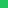
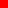
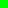
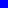
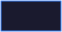

# Swatch Complete Guide

The swatch component is mdfx's most versatile visual primitive. This guide covers every parameter and configuration option.

---

## Basic Syntax

```markdown
{{ui:swatch:COLOR/}}
```

Where `COLOR` is either:
- A **palette name**: `accent`, `success`, `warning`, `error`, `info`, `slate`, `ui.bg`, `ui.surface`, `ui.panel`
- A **hex color**: `FF6B35`, `1a1a2e`, `22C55E` (no `#` prefix)

**Syntax:**

```markdown
{{ui:swatch:accent/}}          <!-- Uses palette accent color (F41C80) -->
{{ui:swatch:success/}}         <!-- Uses palette success (22C55E) -->
{{ui:swatch:FF6B35/}}          <!-- Direct hex color -->
{{ui:swatch:1a1a2e/}}          <!-- Dark color -->
```

**Rendered:**

   

---

## All Parameters

| Parameter | Type | Default | Backend | Description |
|-----------|------|---------|---------|-------------|
| `color` | hex/palette | *required* | Both | The fill color (first positional argument) |
| `style` | enum | flat-square | Both | Corner style and effects |
| `label` | string | none | Both | Text label centered on swatch |
| `label_color` | hex/palette | white | Both | Label text color |
| `icon` | string | none | Both | Simple Icons logo name |
| `icon_color` | hex/palette | white | Both | Icon color |
| `logo_size` | string | none | **Shields only** | Logo size ("auto" for adaptive) |
| `width` | integer | 20 | **SVG only** | Width in pixels |
| `height` | integer | 20 | **SVG only** | Height in pixels |
| `opacity` | float | 1.0 | **SVG only** | Fill opacity (0.0 to 1.0) |
| `border` | hex/palette | none | **SVG only** | Border color |
| `border_width` | integer | 1 | **SVG only** | Border thickness in pixels |
| `rx` | integer | style-based | **SVG only** | Horizontal corner radius in pixels |
| `ry` | integer | same as rx | **SVG only** | Vertical corner radius in pixels |
| `shadow` | string | none | **SVG only** | Drop shadow: "color:blur:offset_x:offset_y" |
| `gradient` | string | none | **SVG only** | Gradient fill: "direction:color1:color2" |
| `stroke_dash` | string | none | **SVG only** | Dashed border: "dash:gap" pattern |

> **Note:** Parameters marked "SVG only" require `--backend svg`. Parameters marked "Shields only" only affect the shields.io backend.

---

## Dimensions (SVG Backend Only)

> ⚠️ **SVG backend required.** Use `mdfx process --backend svg` to enable custom dimensions.

### Width & Height

Control swatch size for any purpose:

**Syntax:**
```markdown
{{ui:swatch:accent:width=20:height=20/}}    <!-- Standard badge -->
{{ui:swatch:accent:width=40:height=20/}}    <!-- Wide badge -->
{{ui:swatch:accent:width=100:height=20/}}   <!-- Bar -->
{{ui:swatch:accent:width=200:height=20/}}   <!-- Wide bar -->
```

**SVG Rendered:**

   

**Shields (ignores dimensions):**

   

### Wide Bars

**SVG Rendered:**


### Tiny Indicators

**Syntax:**
```markdown
{{ui:swatch:22C55E:width=8:height=8/}}
{{ui:swatch:EAB308:width=8:height=8/}}
{{ui:swatch:EF4444:width=8:height=8/}}
```

**SVG Rendered:**

  

### Pixel Art

Create pixel art with small swatches:

**Syntax:**
```markdown
{{ui:swatch:FF0000:width=8:height=8/}}{{ui:swatch:00FF00:width=8:height=8/}}{{ui:swatch:0000FF:width=8:height=8/}}
```

**SVG Rendered:**



**Mini Palette:**


---

## Styles

The `style` parameter changes corner radius and effects:

| Style | Corners | Effect | Best For |
|-------|---------|--------|----------|
| `flat-square` | Sharp (rx=0) | None | Modern, technical |
| `flat` | Rounded (rx=3) | None | Friendly, approachable |
| `plastic` | Rounded (rx=3) | Gradient shine | Glossy, 3D look |
| `for-the-badge` | Rounded (rx=3) | Taller (28px) | Headers, emphasis |
| `social` | Very rounded (rx=10) | Pill shape | Buttons, tags |

**Syntax:**

```markdown
{{ui:swatch:accent:style=flat-square/}}   <!-- Sharp corners -->
{{ui:swatch:accent:style=flat/}}          <!-- Slightly rounded -->
{{ui:swatch:accent:style=plastic/}}       <!-- Shiny 3D effect -->
{{ui:swatch:accent:style=for-the-badge/}} <!-- Taller badge -->
{{ui:swatch:accent:style=social/}}        <!-- Pill/capsule shape -->
```

**Rendered:**

 flat-square
 flat
 plastic
 for-the-badge
 social

---

## Opacity (SVG Backend Only)

> ⚠️ **SVG backend required.** Use `mdfx process --backend svg` to enable opacity.

Control transparency with `opacity` (0.0 to 1.0):

**Syntax:**
```markdown
{{ui:swatch:accent:width=50:height=30:opacity=1.0/}}   <!-- Fully opaque -->
{{ui:swatch:accent:width=50:height=30:opacity=0.75/}}  <!-- 75% visible -->
{{ui:swatch:accent:width=50:height=30:opacity=0.5/}}   <!-- Half transparent -->
{{ui:swatch:accent:width=50:height=30:opacity=0.25/}}  <!-- 25% visible -->
```

**SVG Rendered:**

   

**Shields (ignores opacity):**

   

### Depth Illusion

Create layered depth effects with decreasing opacity:

**Syntax:**
```markdown
{{ui:swatch:3B82F6:width=200:height=30:opacity=1.0/}}
{{ui:swatch:3B82F6:width=180:height=30:opacity=0.75/}}
{{ui:swatch:3B82F6:width=160:height=30:opacity=0.50/}}
{{ui:swatch:3B82F6:width=140:height=30:opacity=0.25/}}
```

**SVG Rendered:**


### Invisible Spacers

Use `opacity=0` for invisible spacing:

```markdown
{{ui:swatch:000000:width=50:height=20:opacity=0/}}  <!-- Invisible spacer -->
```

---

## Borders (SVG Backend Only)

> ⚠️ **SVG backend required.** Use `mdfx process --backend svg` to enable borders.

Add borders with `border` (color) and `border_width`:

### Simple Borders

**Syntax:**
```markdown
{{ui:swatch:1a1a2e:width=60:height=30:border=F41C80/}}
{{ui:swatch:1a1a2e:width=60:height=30:border=22C55E/}}
{{ui:swatch:1a1a2e:width=60:height=30:border=3B82F6/}}
```

**SVG Rendered:**

  

**Shields (no border support):**

  

### Border Widths

**Syntax:**
```markdown
{{ui:swatch:292A2D:width=80:height=40:border=FFFFFF:border_width=1/}}
{{ui:swatch:292A2D:width=80:height=40:border=FFFFFF:border_width=2/}}
{{ui:swatch:292A2D:width=80:height=40:border=FFFFFF:border_width=4/}}
```

**SVG Rendered:**

  

### Glassmorphism

Combine opacity and borders for a frosted glass effect:

**Syntax:**
```markdown
{{ui:swatch:FFFFFF:width=200:height=60:opacity=0.15:border=FFFFFF:border_width=1/}}
```

**SVG Rendered:**


### Dashed Borders

Add dashed or dotted borders with `stroke_dash`. Format: "dash:gap" (e.g., "4:2" for 4px dash, 2px gap).

**Syntax:**
```markdown
{{ui:swatch:1a1a2e:width=100:height=40:border=F41C80:stroke_dash=4:2/}}
{{ui:swatch:1a1a2e:width=100:height=40:border=22C55E:stroke_dash=8:4/}}
{{ui:swatch:1a1a2e:width=100:height=40:border=3B82F6:stroke_dash=2:2/}}
```

**Use cases:** Cut lines, selection indicators, placeholder outlines.

---

## Corner Radius (SVG Backend Only)

> ⚠️ **SVG backend required.** Use `mdfx process --backend svg` to enable custom corner radius.

Override style-based corner radius with `rx` (horizontal) and `ry` (vertical):

**Syntax:**
```markdown
{{ui:swatch:accent:width=60:height=40:rx=0/}}     <!-- Sharp corners -->
{{ui:swatch:accent:width=60:height=40:rx=5/}}     <!-- Slightly rounded -->
{{ui:swatch:accent:width=60:height=40:rx=10/}}    <!-- More rounded -->
{{ui:swatch:accent:width=60:height=40:rx=20/}}    <!-- Pill shape -->
```

### Elliptical Corners

Use different `rx` and `ry` values for elliptical corners:

**Syntax:**
```markdown
{{ui:swatch:3B82F6:width=80:height=40:rx=20:ry=5/}}   <!-- Wide ellipse corners -->
{{ui:swatch:22C55E:width=80:height=40:rx=5:ry=20/}}   <!-- Tall ellipse corners -->
```

---

## Shadows (SVG Backend Only)

> ⚠️ **SVG backend required.** Use `mdfx process --backend svg` to enable drop shadows.

Add drop shadows with `shadow`. Format: "color:blur:offset_x:offset_y"

- **color**: Shadow color (hex without #)
- **blur**: Blur radius in pixels
- **offset_x**: Horizontal offset (can be negative)
- **offset_y**: Vertical offset (can be negative)

**Syntax:**
```markdown
{{ui:swatch:F41C80:width=80:height=40:shadow=000000:4:2:2/}}    <!-- Standard shadow -->
{{ui:swatch:3B82F6:width=80:height=40:shadow=000000:8:4:4/}}    <!-- Larger shadow -->
{{ui:swatch:22C55E:width=80:height=40:shadow=000000:2:0:2/}}    <!-- Bottom shadow only -->
```

### Glow Effects

Use colored shadows for glow effects:

**Syntax:**
```markdown
{{ui:swatch:F41C80:width=80:height=40:shadow=F41C80:8:0:0/}}    <!-- Pink glow -->
{{ui:swatch:3B82F6:width=80:height=40:shadow=3B82F6:8:0:0/}}    <!-- Blue glow -->
{{ui:swatch:22C55E:width=80:height=40:shadow=22C55E:8:0:0/}}    <!-- Green glow -->
```

---

## Gradients (SVG Backend Only)

> ⚠️ **SVG backend required.** Use `mdfx process --backend svg` to enable gradient fills.

Add gradient fills with `gradient`. Format: "direction:color1:color2"

**Directions:**
- `horizontal` - Left to right gradient
- `vertical` - Top to bottom gradient
- `diagonal` - Top-left to bottom-right gradient

**Syntax:**
```markdown
{{ui:swatch:000000:width=120:height=40:gradient=horizontal:FF0000:0000FF/}}   <!-- Red to blue -->
{{ui:swatch:000000:width=120:height=40:gradient=vertical:22C55E:1a1a2e/}}     <!-- Green to dark -->
{{ui:swatch:000000:width=120:height=40:gradient=diagonal:F41C80:3B82F6/}}     <!-- Pink to blue diagonal -->
```

### Sunset Gradient

**Syntax:**
```markdown
{{ui:swatch:000000:width=200:height=60:gradient=vertical:FF6B35:1a1a2e/}}
```

### Metallic Effect

Combine gradients with borders for metallic buttons:

**Syntax:**
```markdown
{{ui:swatch:000000:width=100:height=40:gradient=vertical:666666:333333:border=888888/}}
```

---

## Labels

Add text labels with `label` and optional `label_color`. **Labels work with both backends.**

**Syntax:**

```markdown
{{ui:swatch:accent:label=ACTIVE/}}
{{ui:swatch:1a1a2e:label=DARK MODE/}}
{{ui:swatch:22C55E:label=ONLINE/}}
{{ui:swatch:EF4444:label=OFFLINE/}}
{{ui:swatch:EAB308:label=PENDING/}}
```

**Rendered:**


### Status Labels

**Syntax:**

```markdown
{{ui:swatch:22C55E:label=99.9%/}}
{{ui:swatch:3B82F6:label=Coverage 94%/}}
{{ui:swatch:1a1a2e:label=ACCESS GRANTED/}}
```

**Rendered:**


---

## Icons

Add Simple Icons logos with `icon` and optional `icon_color`. **Icons work with both backends.**

**Syntax:**

```markdown
{{ui:swatch:000000:icon=rust:icon_color=DEA584/}}
{{ui:swatch:3178C6:icon=typescript:icon_color=FFFFFF/}}
{{ui:swatch:2496ED:icon=docker:icon_color=FFFFFF/}}
{{ui:swatch:000000:icon=github:icon_color=FFFFFF/}}
{{ui:swatch:FC6D26:icon=gitlab:icon_color=FFFFFF/}}
```

**Rendered:**


**Note:** Uses [Simple Icons](https://simpleicons.org/) via shields.io. Browse the site for available logos.

### Logo Size (Shields.io)

Control logo size with `logo_size`. Use `auto` for adaptive sizing that scales with badge style.

**Syntax:**

```markdown
{{ui:swatch:000000:icon=rust:icon_color=DEA584:logo_size=auto/}}
{{ui:swatch:3178C6:icon=typescript:icon_color=FFFFFF:logo_size=auto/}}
```

**Rendered:**


---

## Color Palette Reference

Built-in palette colors:

| Name | Hex | Swatch |
|------|-----|--------|
| `accent` | F41C80 |  |
| `success` | 22C55E |  |
| `warning` | EAB308 |  |
| `error` | EF4444 |  |
| `info` | 3B82F6 |  |
| `slate` | 6B7280 |  |
| `ui.bg` | 292A2D |  |
| `ui.surface` | 292C34 |  |
| `ui.panel` | 282F3C |  |
| `white` | FFFFFF |  |
| `black` | 000000 |  |

---

## Complete Examples

### Status Dashboard

**Syntax:**

```markdown
{{ui:swatch:22C55E:style=social/}} API Server: Online
{{ui:swatch:22C55E:style=social/}} Database: Healthy
{{ui:swatch:EAB308:style=social/}} Cache: Degraded
{{ui:swatch:EF4444:style=social/}} Queue: Critical
```

**Rendered:**

 API Server: Online
 Database: Healthy
 Cache: Degraded
 Queue: Critical

### Progress Bar

Custom width progress bars require the SVG backend:

**Syntax (SVG):**
```markdown
{{ui:swatch:22C55E:width=150:height=20/}}{{ui:swatch:333333:width=50:height=20/}}
```

**SVG Rendered:**


**Shields alternative (use labels instead of dimensions):**

```markdown
{{ui:swatch:22C55E:label=75%/}}{{ui:swatch:333333/}}
```

**Shields Rendered:**


### Color Palette Documentation

**Syntax:**

```markdown
{{ui:row:align=center}}
{{ui:swatch:1a1a2e:label=Primary/}}
{{ui:swatch:2d2d44:label=Secondary/}}
{{ui:swatch:4a4a6a:label=Tertiary/}}
{{ui:swatch:6b6b8d:label=Muted/}}
{{/ui}}
```

**Rendered:**

<p align="center">
   
</p>

### Color Gradient

**Syntax:**

```markdown
{{ui:swatch:0a0a0a/}}{{ui:swatch:1a0a0a/}}{{ui:swatch:3a1010/}}{{ui:swatch:5a1a1a/}}{{ui:swatch:8B2500/}}{{ui:swatch:CD3700/}}{{ui:swatch:FF4500/}}{{ui:swatch:FF6347/}}{{ui:swatch:FFD700/}}
```

**Rendered:**


### Tech Stack with Icons

**Syntax:**

```markdown
{{ui:row:align=center}}
{{ui:swatch:DEA584:icon=rust:icon_color=000000/}}
{{ui:swatch:F7DF1E:icon=javascript:icon_color=000000/}}
{{ui:swatch:3178C6:icon=typescript:icon_color=FFFFFF/}}
{{/ui}}
```

**Rendered:**

<p align="center">
  
</p>

### Warning Labels

**Syntax:**

```markdown
{{ui:row:align=center}}
{{ui:swatch:FFFF00:label=RADIATION/}}
{{ui:swatch:FF6600:label=BIOHAZARD/}}
{{ui:swatch:FF0000:label=DANGER/}}
{{/ui}}
```

**Rendered:**

<p align="center">
  
</p>

---

## SVG-Only Examples Gallery

The following examples require `--backend svg` for full effect.

### Large Panel

**Syntax:**
```markdown
{{ui:swatch:F41C80:width=250:height=80:label=HERO BANNER/}}
```

**SVG Rendered:**


### Summary

SVG backend features not available in shields.io:
- **Custom dimensions** - width and height in pixels
- **Opacity** - transparency from 0.0 to 1.0
- **Borders** - colored borders with custom width, dashed patterns
- **Corner radius** - custom rx/ry for precise rounded corners
- **Drop shadows** - shadows with custom color, blur, and offset
- **Gradients** - horizontal, vertical, and diagonal gradient fills
- **Pixel art** - precise small swatches for creating graphics

---

## Backend Differences

### Shields Backend (default)

Uses shields.io badges. Supports:
- Color (palette names or hex)
- Style (5 badge styles)
- Labels (text on badges)
- Icons (Simple Icons logos)
- Logo size (`logo_size=auto` for adaptive sizing)

```bash
mdfx process template.md --target github
```

### SVG Backend

Full control over all parameters:

```bash
mdfx process template.md --backend svg --assets-dir assets
```

Additional SVG-only features:
- Custom width/height
- Opacity/transparency
- Borders with custom colors/width
- Dashed borders (`stroke_dash`)
- Custom corner radius (`rx`/`ry`)
- Drop shadows (`shadow`)
- Gradient fills (`gradient`)

---

## Tips & Tricks

### 1. Center with Row

**Syntax:**

```markdown
{{ui:row:align=center}}
{{ui:swatch:accent:label=CENTERED/}}
{{/ui}}
```

**Rendered:**

<p align="center">

</p>

### 2. Style Variations

Different styles for different contexts:

**Syntax:**

```markdown
{{ui:swatch:accent:style=flat-square:label=Default/}}
{{ui:swatch:accent:style=for-the-badge:label=Prominent/}}
{{ui:swatch:accent:style=social:label=Subtle/}}
```

**Rendered:**


### 3. Icon + Label Combinations

```markdown
{{ui:swatch:000000:icon=github:icon_color=FFFFFF:label=GitHub/}}
```

**Rendered:**


### 4. SVG-Only: Opacity for Layering

*Requires `--backend svg`:*

```markdown
{{ui:swatch:accent:width=100:height=30:opacity=1.0/}}
{{ui:swatch:accent:width=90:height=30:opacity=0.7/}}
{{ui:swatch:accent:width=80:height=30:opacity=0.4/}}
```

### 5. SVG-Only: Border Highlights

*Requires `--backend svg`:*

```markdown
{{ui:swatch:1a1a2e:width=200:height=60:border=F41C80:border_width=3:label=HIGHLIGHTED/}}
```

---

## See Also

- [Components Guide](COMPONENTS-GUIDE.md)
- [API Guide](../API-GUIDE.md)
- [Examples README](../../examples/README.md)

---

<p align="center">
ʀᴇɴᴅᴇʀᴇᴅ ᴡɪᴛʜ ᴍᴅꜰx
</p>
