# Version & License Badge Guide

Semantic badges for version numbers and software licenses with automatic color-coding.

## Table of Contents

- [Version Badges](#version-badges)
  - [Basic Syntax](#basic-syntax)
  - [Auto-Detection](#auto-detection)
  - [Status Override](#status-override)
  - [Version Parameters](#version-parameters)
  - [Custom Styling](#custom-styling)
- [License Badges](#license-badges)
  - [License Syntax](#license-syntax)
  - [License Categories](#license-categories)
  - [License Parameters](#license-parameters)
  - [Common Licenses](#common-licenses)
- [Combining with Tech Badges](#combining-with-tech-badges)
- [Tips & Tricks](#tips--tricks)

---

## Version Badges

### Basic Syntax

```markdown
{{ui:version:VERSION/}}
```

The version component automatically detects stability from the version string and applies semantic coloring.

| Syntax | Rendered |
|--------|----------|
| `{{ui:version:1.0.0/}}` | 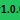 |
| `{{ui:version:2.5.3/}}` | 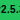 |
| `{{ui:version:10.0.0/}}` | 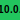 |

---

### Auto-Detection

Version strings are automatically parsed to determine status:

#### Stable Versions (Green)

Released production versions (1.x.x and higher):

| Syntax | Rendered |
|--------|----------|
| `{{ui:version:1.0.0/}}` |  |
| `{{ui:version:3.2.1/}}` | 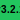 |
| `{{ui:version:12.0.0/}}` | 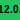 |

#### Beta Versions (Yellow)

Pre-release testing versions (0.x.x or -beta/-rc suffix):

| Syntax | Rendered |
|--------|----------|
| `{{ui:version:0.9.0/}}` | 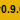 |
| `{{ui:version:2.0.0-beta/}}` | 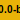 |
| `{{ui:version:1.5.0-beta.2/}}` |  |
| `{{ui:version:3.0.0-rc.1/}}` | 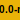 |
| `{{ui:version:2.0.0-preview/}}` |  |

#### Alpha Versions (Orange)

Early development versions:

| Syntax | Rendered |
|--------|----------|
| `{{ui:version:1.0.0-alpha/}}` | 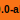 |
| `{{ui:version:2.0.0-alpha.3/}}` | 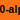 |

#### Development Versions (Purple)

Unstable development builds:

| Syntax | Rendered |
|--------|----------|
| `{{ui:version:1.0.0-dev/}}` | 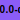 |
| `{{ui:version:2.0.0-snapshot/}}` | 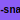 |
| `{{ui:version:3.0.0-nightly/}}` |  |

#### Deprecated Versions (Red)

End-of-life or unsupported versions:

| Syntax | Rendered |
|--------|----------|
| `{{ui:version:1.0.0-deprecated/}}` |  |
| `{{ui:version:0.5.0-eol/}}` | 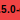 |

---

### Status Override

Override auto-detection with the `status` parameter:

| Syntax | Rendered |
|--------|----------|
| `{{ui:version:1.0.0:status=stable/}}` |  |
| `{{ui:version:1.0.0:status=beta/}}` | 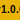 |
| `{{ui:version:1.0.0:status=alpha/}}` | 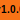 |
| `{{ui:version:1.0.0:status=dev/}}` | 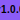 |
| `{{ui:version:1.0.0:status=deprecated/}}` | 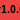 |

---

### Version Parameters

| Parameter | Type | Default | Description |
|-----------|------|---------|-------------|
| `version` | string | *required* | Version string (first positional argument) |
| `status` | enum | auto | Override: stable, beta, alpha, dev, deprecated |
| `bg` | color | auto | Custom background color |
| `text` | color | auto | Custom text color |
| `prefix` | string | "v" | Version prefix (use "" to disable) |
| `style` | enum | flat-square | Badge style |

---

### Custom Styling

#### Without Prefix

| Syntax | Rendered |
|--------|----------|
| `{{ui:version:1.0.0:prefix=/}}` |  |
| `{{ui:version:2.5.0:prefix=/}}` | 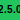 |

#### Custom Colors

| Syntax | Rendered |
|--------|----------|
| `{{ui:version:1.0.0:bg=cobalt/}}` | 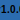 |
| `{{ui:version:2.0.0:bg=plum/}}` | 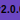 |
| `{{ui:version:3.0.0:bg=accent/}}` | 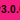 |

#### Badge Styles

| Syntax | Rendered |
|--------|----------|
| `{{ui:version:1.0.0:style=flat/}}` |  |
| `{{ui:version:1.0.0:style=plastic/}}` |  |
| `{{ui:version:1.0.0:style=for-the-badge/}}` | 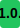 |

---

## License Badges

### License Syntax

```markdown
{{ui:license:LICENSE/}}
```

The license component categorizes licenses and applies semantic coloring.

| Syntax | Rendered |
|--------|----------|
| `{{ui:license:MIT/}}` |  |
| `{{ui:license:Apache-2.0/}}` |  |
| `{{ui:license:GPL-3.0/}}` | 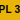 |

---

### License Categories

#### Permissive Licenses (Green)

Open-source friendly, minimal restrictions:

| Syntax | Rendered |
|--------|----------|
| `{{ui:license:MIT/}}` |  |
| `{{ui:license:Apache-2.0/}}` |  |
| `{{ui:license:BSD-3-Clause/}}` | 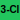 |
| `{{ui:license:BSD-2-Clause/}}` | 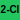 |
| `{{ui:license:ISC/}}` |  |

#### Weak Copyleft (Blue)

File-level copyleft requirements:

| Syntax | Rendered |
|--------|----------|
| `{{ui:license:LGPL-3.0/}}` | 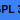 |
| `{{ui:license:LGPL-2.1/}}` | 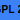 |
| `{{ui:license:MPL-2.0/}}` |  |
| `{{ui:license:EPL-2.0/}}` | 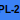 |

#### Copyleft (Yellow)

Strong copyleft requirements:

| Syntax | Rendered |
|--------|----------|
| `{{ui:license:GPL-3.0/}}` |  |
| `{{ui:license:GPL-2.0/}}` |  |
| `{{ui:license:AGPL-3.0/}}` | 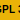 |

#### Public Domain (Cyan)

No restrictions:

| Syntax | Rendered |
|--------|----------|
| `{{ui:license:CC0/}}` |  |
| `{{ui:license:Unlicense/}}` |  |

#### Proprietary (Gray)

Closed source:

| Syntax | Rendered |
|--------|----------|
| `{{ui:license:Proprietary/}}` | 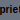 |
| `{{ui:license:Commercial/}}` |  |

---

### License Parameters

| Parameter | Type | Default | Description |
|-----------|------|---------|-------------|
| `license` | string | *required* | License identifier (first positional argument) |
| `label` | string | auto | Custom label (default: formatted license name) |
| `bg` | color | auto | Custom background color |
| `text` | color | auto | Custom text color |
| `style` | enum | flat-square | Badge style |

---

### Common Licenses

Quick reference for popular licenses:

| License | Category | Description |
|---------|----------|-------------|
| MIT | Permissive | Simple, do anything with attribution |
| Apache-2.0 | Permissive | Patent protection, attribution required |
| BSD-3-Clause | Permissive | Attribution, no endorsement |
| GPL-3.0 | Copyleft | Derivatives must be GPL |
| LGPL-3.0 | Weak Copyleft | Library linking exception |
| MPL-2.0 | Weak Copyleft | File-level copyleft |
| AGPL-3.0 | Copyleft | Network use triggers copyleft |
| CC0 | Public Domain | No restrictions whatsoever |

---

### Custom Labels

| Syntax | Rendered |
|--------|----------|
| `{{ui:license:MIT:label=MIT License/}}` |  |
| `{{ui:license:Apache-2.0:label=Apache/}}` | 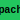 |
| `{{ui:license:GPL-3.0:label=GPLv3/}}` |  |

### Custom Colors

| Syntax | Rendered |
|--------|----------|
| `{{ui:license:MIT:bg=cobalt/}}` |  |
| `{{ui:license:Apache-2.0:bg=plum/}}` |  |
| `{{ui:license:GPL-3.0:bg=accent/}}` | 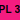 |

---

## Combining with Tech Badges

Create comprehensive project headers with tech, version, and license badges:

### Project Header Example

```markdown
{{ui:tech:rust/}} {{ui:version:1.0.0/}} {{ui:license:MIT/}}
```

  

### Full Stack Example

```markdown
{{ui:tech:typescript/}} {{ui:tech:react/}} {{ui:version:2.5.0-beta/}} {{ui:license:Apache-2.0/}}
```

  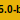 

### Deprecated Project

```markdown
{{ui:tech:python/}} {{ui:version:0.5.0:status=deprecated/}} {{ui:license:GPL-3.0/}}
```

 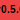 

---

## Tips & Tricks

### 1. Use Auto-Detection for Clean Source

Let mdfx detect the version status automatically:

```markdown
<!-- Clean source, smart colors -->
{{ui:version:1.0.0/}}       <!-- Green - stable -->
{{ui:version:0.9.0/}}       <!-- Yellow - 0.x is beta -->
{{ui:version:2.0.0-rc.1/}}  <!-- Yellow - prerelease -->
```

### 2. Version + URL for Releases

Combine with the `url` parameter for clickable release links:

```markdown
<!-- Links to GitHub release -->
{{ui:tech:rust:url=https://github.com/org/repo/}}
```

### 3. Consistent Badge Styles

Use the same style across all badges for visual consistency:

| Consistent Flat | Consistent For-The-Badge |
|-----------------|-------------------------|
|    |    |

### 4. Custom Colors for Branding

Override default colors to match your project theme:

| Syntax | Rendered |
|--------|----------|
| `{{ui:version:1.0.0:bg=1a1a2e:text=FFFFFF/}}` | 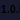 |
| `{{ui:license:MIT:bg=1a1a2e:text=FFFFFF/}}` |  |

---

## See Also

- [Tech Badges](TECH-GUIDE.md) - Technology logo badges
- [Swatches](SWATCH-GUIDE.md) - Color block component
- [Components](COMPONENTS-GUIDE.md) - All UI components
- [Colors](COLORS-GUIDE.md) - Palette reference
