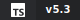
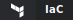

# Dashboard Visualization Showcase

**A comprehensive demonstration of mdfx visualization components**

---

## System Monitoring Dashboard

### Real-Time Metrics

| Metric | Gauge | Current | Trend (7d) |
|--------|-------|---------|------------|
| CPU |  | 45% |  |
| Memory |  | 72% |  |
| Disk |  | 88% |  |
| Network |  | 35% |  |

### Service Health

 API  Database  Cache  Queue

---

## Project Progress Tracker

### Sprint Status

| Feature | Progress | Status |
|---------|----------|--------|
| Authentication |  | Complete |
| User Dashboard |  | In Review |
| API Endpoints |  | Active |
| Documentation |  | In Progress |
| Testing |  | Starting |

### Overall Completion

### Milestone Timeline

▓▒░ 
 Phase 1 →  Phase 2 →  Phase 3 →  Phase 4
 ░▒▓

---

## Performance Analytics

### Response Time Distribution

**Average:** 48ms | **P95:** 55ms | **P99:** 62ms

### Request Volume (24h)

### Error Rate Trend

---

## User Satisfaction

### Overall Ratings

 **4.5/5** Overall  **4.8/5** UX  **4.2/5** Performance  **4.6/5** Support

### Satisfaction Breakdown

| Category | Rating | Score |
|----------|--------|-------|
| Ease of Use |  | Excellent |
| Features |  | Great |
| Reliability |  | Good |
| Value |  | Great |
| Support |  | Excellent |

### NPS Score

**Net Promoter Score: 72** (Excellent)

---

## Tech Stack

### Primary Technologies (Icon Only)

   

### Technologies with Versions (Two-Segment Badges)

   

### Styled Badges with Borders

  

### Custom Color Themes

  

### Infrastructure with Labels

   

### DevOps Tools

   

### Accent Bordered Tech

   

### Full Stack Banner

---

## Activity Waveforms

### Audio Processing

### Signal Analysis

### Balanced Data

---

## Status Indicators

### Environment Status

  

### Build Pipeline

| Stage | Status | Duration |
|-------|--------|----------|
| Build |  | 2m 15s |
| Test |  | 4m 32s |
| Lint |  | 45s |
| Deploy |  | 1m 20s |

### Health Check Timeline

         

---

## Volume & Sliders

### Audio Mixer

| Channel | Level |
|---------|-------|
| Master |  |
| Vocals |  |
| Bass |  |
| Drums |  |

### Brightness Control

---

## Data Grids

### Repository Stats

| Repository | Stars | Activity | Health |
|------------|-------|----------|--------|
| core-api |  |  |  |
| web-app |  |  |  |
| mobile |  |  |  |
| cli-tools |  |  |  |

---

## Creative Decorations

### Section Dividers

---

## Summary Stats

★ 

 Uptime  Rating  Sprint

 ☆

---

*Generated with mdfx - Markdown Effects for Beautiful Documentation*
