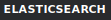

# 🆃🅴🅲🅷 Badge Showcase


*Comprehensive demonstration of tech badges, text styles, glyphs, and creative combinations*

---

## 𝐋·𝐎·𝐆·𝐎· ·𝐒·𝐈·𝐙·𝐄·𝐒

Scale your tech logos from tiny to prominent:

| Size | Preset | Example |
|------|--------|---------|
| Extra Small | `logo_size=xs` |  |
| Small | `logo_size=sm` |  |
| Medium (default) | `logo_size=md` |  |
| Large | `logo_size=lg` |  |
| Extra Large | `logo_size=xl` |  |
| XXL | `logo_size=xxl` |  |

### Size Comparison Row

<p align="center">
     
</p>

---

## 🅝🅔🅦 Custom Icons

Use any SVG path data for unsupported technologies:

<p align="center">
  
</p>

---

## 🅂🅃🅈🄻🄴 Gallery

### Badge Styles

| Style | Result |
|-------|--------|
| `flat` |  |
| `flat-square` |  |
| `plastic` |  |
| `for-the-badge` |  |

### Outline Mode ★︎

Ghost-style badges with transparent backgrounds:

<p align="center">
   
</p>

<p align="center">
  
</p>

---

## 𝐁𝐎𝐑𝐃𝐄𝐑𝐒 & 𝒞ℴ𝓇𝓃ℯ𝓇𝓈

### Accent Borders

<p align="center">
  
</p>

### Rounded Corners

<p align="center">
   
</p>

### Pill Badges

<p align="center">
  
</p>

---

## ℌ𝔥𝔢𝔳𝔯𝔬𝔫 Badges →︎

Directional arrow shapes:

### Right Chevron (→)
<p align="center">

</p>

### Left Chevron (←)
<p align="center">

</p>

### Pipeline Flow
<p align="center">

</p>

---

## 𝐓★𝐖★𝐎★ ★𝐒★𝐄★𝐆★𝐌★𝐄★𝐍★𝐓 Colors

### Independent Segment Colors

<p align="center">
  
</p>

### Gradient Feel

<p align="center">
  
</p>

---

## 🆃🅴🆇🆃 + ⓉⒺⒸⒽ Combos

### ▓︎▒︎░︎ 𝐏·𝐑·𝐈·𝐌·𝐀·𝐑·𝐘· ·𝐒·𝐓·𝐀·𝐂·𝐊 ░︎▒︎▓︎

<p align="center">
   
</p>

### █︎▌︎𝔅𝔞𝔠𝔨𝔢𝔫𝔡 𝔖𝔢𝔯𝔳𝔦𝔠𝔢𝔰

<p align="center">
  
</p>

### ★︎ ℱ𝓇ℴ𝓃𝓉ℯ𝓃𝒹 ℳ𝒶ℊ𝒾𝒸 ☆︎

<p align="center">
  
</p>

---

## ①︎ Status Labels with Text Styles

### 🅿🆁🅾🅳 Production Stack

<p align="center">
  
</p>

### 🅓🅔🅥 Development Tools

<p align="center">
   
</p>

### 🄱🄴🅃🄰 Experimental

<p align="center">
 
</p>

---

## 𝐂◆𝐑◆𝐄◆𝐀◆𝐓◆𝐈◆𝐕◆𝐄◆ ◆𝐋◆𝐀◆𝐘◆𝐎◆𝐔◆𝐓◆𝐒

### Glowing Tech Row


### Categorized Stack

▓︎▒︎░︎ 🅻🅰🅽🅶 ░︎▒︎▓︎
   

▓︎▒︎░︎ 🅸🅽🅵🆁🅰 ░︎▒︎▓︎
   

▓︎▒︎░︎ 🅳🅰🆃🅰 ░︎▒︎▓︎
   

---

## 𝒯♥𝓎♥𝓅♥ℴ♥ℊ♥𝓇♥𝒶♥𝓅♥𝒽♥𝓎♥ ♥𝒮♥𝒽♥ℴ♥𝓌♥𝒸♥𝒶♥𝓈♥ℯ

### Text Style Headers

𝐌𝐀𝐓𝐇𝐄𝐌𝐀𝐓𝐈𝐂𝐀𝐋 𝐁𝐎𝐋𝐃 → Primary headers
ＦＵＬＬ　ＷＩＤＴＨ → Wide emphasis
𝔉𝔯𝔞𝔨𝔱𝔲𝔯 𝔊𝔬𝔱𝔥𝔦𝔠 → Medieval feel
𝒮𝒸𝓇𝒾𝓅𝓉 ℰ𝓁ℯℊ𝒶𝓃𝒸ℯ → Flowing style
𝔻𝕠𝕦𝕓𝕝𝕖 𝕊𝕥𝕣𝕦𝕔𝕜 → Mathematical

### Enclosed Styles for Labels

🅽🅴🆆 Feature announcement
🅗🅞🅣 Trending item
🄸🄽🄵🄾 Information note
ⓉⒾⓅ Helpful hint

### Separators Gallery

𝐃·𝐎·𝐓· ·𝐒·𝐄·𝐏·𝐀·𝐑·𝐀·𝐓·𝐄·𝐃
𝐒★𝐓★𝐀★𝐑★ ★𝐒★𝐄★𝐏★𝐀★𝐑★𝐀★𝐓★𝐄★𝐃
𝐀→𝐑→𝐑→𝐎→𝐖→ →𝐅→𝐋→𝐎→𝐖
𝐃◆𝐈◆𝐀◆𝐌◆𝐎◆𝐍◆𝐃◆ ◆𝐂◆𝐇◆𝐀◆𝐈◆𝐍
𝐇♥𝐄♥𝐀♥𝐑♥𝐓♥ ♥𝐋♥𝐎♥𝐕♥𝐄

---

## ★︎ Glyph Decorations ★︎

### Number Badges

①︎ Install dependencies
②︎ Configure environment
③︎ Run build
④︎ Deploy to production

### Checkboxes

☑︎ Rust installed
☑︎ Docker running
☐︎ Tests passing
☐︎ Documentation updated

### Decorative Dividers

★︎★︎★︎ 𝐒𝐄𝐂𝐓𝐈𝐎𝐍 ★︎★︎★︎

◆︎ ◆︎ ◆︎ ◆︎ ◆︎

---

## ═︎═︎═︎ 𝐌𝐄𝐆𝐀 𝐒𝐇𝐎𝐖𝐂𝐀𝐒𝐄 ═︎═︎═︎

### Full-Stack Developer Badge Wall

<p align="center">
  
</p>

<p align="center">
  
</p>

<p align="center">
  
</p>

<p align="center">
  
</p>

---

## 🅰🅻🅻 Parameters Demo

One badge, every parameter:


```
{{ui:tech:rust:
  label=Rust v1.80:
  style=flat-square:
  bg=1a1a1a:
  logo=CE412B:
  text_color=CE412B:
  border=CE412B:
  border_width=2:
  rx=10:
  logo_size=lg/}}
```

---


★︎ *Generated with mdfx — where markdown becomes art* ★︎
