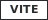

# 🆃🅴🅲🅷 Badge Showcase


*Comprehensive demonstration of tech badges, text styles, glyphs, and creative combinations*

---

## 𝐋·𝐎·𝐆·𝐎· ·𝐒·𝐈·𝐙·𝐄·𝐒

Scale your tech logos from tiny to prominent:

| Size | Preset | Example |
|------|--------|---------|
| Extra Small | `logo_size=xs` |  |
| Small | `logo_size=sm` |  |
| Medium (default) | `logo_size=md` |  |
| Large | `logo_size=lg` |  |
| Extra Large | `logo_size=xl` |  |
| XXL | `logo_size=xxl` |  |

---

## 🅝🅔🅦 Custom Icons

Use any SVG path data for unsupported technologies:

<p align="center">
  
</p>

---

## 🅂🅃🅈🄻🄴 Gallery

### Badge Styles

| Style | Result |
|-------|--------|
| `flat` |  |
| `flat-square` |  |
| `plastic` |  |
| `for-the-badge` |  |

### Outline Mode ★︎

Ghost-style badges with transparent backgrounds:

<p align="center">
   
</p>

<p align="center">
  
</p>

---

## 𝐁𝐎𝐑𝐃𝐄𝐑𝐒 & 𝒞ℴ𝓇𝓃ℯ𝓇𝓈

### Accent Borders

<p align="center">
  
</p>

### Rounded Corners

<p align="center">
   
</p>

### Pill Badges

<p align="center">
  
</p>

---

## ℌ𝔥𝔢𝔳𝔯𝔬𝔫 Badges →︎

Directional arrow shapes:

### Right Chevron (→)
<p align="center">

</p>

### Left Chevron (←)
<p align="center">

</p>

### Pipeline Flow
<p align="center">

</p>

---

## 𝐓★𝐖★𝐎★ ★𝐒★𝐄★𝐆★𝐌★𝐄★𝐍★𝐓 Colors

### Independent Segment Colors

<p align="center">
  
</p>

### Gradient Feel

<p align="center">
  
</p>

---

## 🆃🅴🆇🆃 + ⓉⒺⒸⒽ Combos

### ▓︎▒︎░︎ 𝐏·𝐑·𝐈·𝐌·𝐀·𝐑·𝐘· ·𝐒·𝐓·𝐀·𝐂·𝐊 ░︎▒︎▓︎

<p align="center">
   
</p>

### █︎▌︎𝔅𝔞𝔠𝔨𝔢𝔫𝔡 𝔖𝔢𝔯𝔳𝔦𝔠𝔢𝔰

<p align="center">
  
</p>

### ★︎ ℱ𝓇ℴ𝓃𝓉ℯ𝓃𝒹 ℳ𝒶ℊ𝒾𝒸 ☆︎

<p align="center">
  
</p>

---

## ①︎ Status Labels with Text Styles

### 🅿🆁🅾🅳 Production Stack

<p align="center">
  
</p>

### 🄱🄴🅃🄰 Experimental

<p align="center">
 
</p>

---

## ▓︎▒︎░︎ 𝐑𝐀𝐈𝐒𝐄𝐃 ░︎▒︎▓︎ Icon Badges

Icons that extend above and below the label section:

### Basic Raised

<p align="center">
  
</p>

### Raised with Large Icons

<p align="center">
  
</p>

---

## 🅰🅻🅻 Parameters Demo

One badge, every parameter:


```
{{ui:tech:rust:
  label=Rust v1.80:
  style=flat-square:
  bg=1a1a1a:
  logo=CE412B:
  text_color=CE412B:
  border=CE412B:
  border_width=2:
  rx=10:
  logo_size=lg/}}
```

---


★︎ *Generated with mdfx — where markdown becomes art* ★︎
